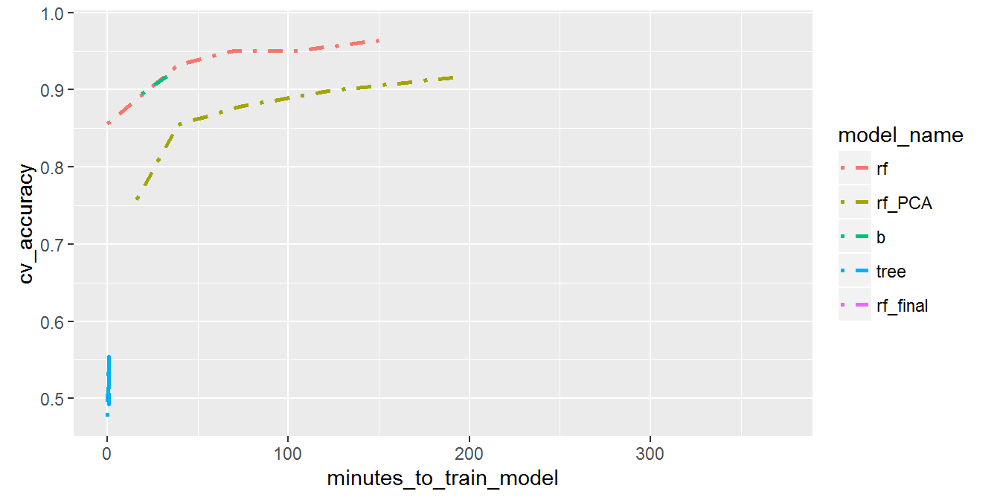

  
```{r}
knitr::opts_chunk$set(echo = FALSE, message=FALSE, warning=FALSE)
```

```{r}
library(dplyr)
library(tidyr)
library(ggplot2)
library(tibble)
library(purrr)
library(broom)
library(gapminder)
```

## Overview

- Tidy Data
- Packages in the Tidyverse
- Managing Multiple Models
- Learning Curves
- Other bits
  
## Tidy Data

[Tidy Data](https://www.jstatsoft.org/article/view/v059i10/v59i10.pdf) by Hadley Wickham in Journal of Statstical Software (2014)

- Each variable forms a column
- Each observation forms a row
- Each type of observational unit forms a table


```{r}
sample <- data_frame(Commodity = c("Bread", "Butter", "Cheese"),
                     Dol14 = c("1.20", "0.60", "3.20"),
                     Dol15 = c("1.25", "0.66", "3.52"),
                     Dol16 = c("1.31", "0.64", "3.67"),
                     Qua14  = c("35", "12", "8"),
                     Qua15  = c("38", "12", "9"),
                     Qua16  = c("37", "14", "6"))
sample
```

## Tidy Data
  
```{r, echo=TRUE}
sample_tidy <- sample %>% 
  gather("Type", "Value", 2:7) %>% 
  mutate(Commodity = factor(Commodity),
         Year      = factor(paste0("20", substr(Type, 4, 5))),
         Type      = factor(substr(Type, 1, 3))) %>% 
  '['(c(1, 2, 4, 3))

sample_tidy
```
  
```{r, echo=TRUE}
sample_tidy %>% 
  ggplot(aes(y = Value, x = Year, col = Commodity, group = Type)) + 
  geom_point() +
  facet_grid(Type ~ .)
```

Bread butter milk prices over three years and quantities produced.

## Tidyverse Packages

  Background image of hex stickers.

Core

- tidyverse
- tibble
- purrr
- tidyr
- dplyr
- broom
- readr
- ggplot2
  
  Vector operations

- hms (times)
- stringr (strings)
- lubridate (dates)
- forcats (factors)

Data import

- DBI (databases)
- haven (SAS, SPSS, Stata)
- httr (APIs)
- jsonlite (JSON)
- readxl (Excel)
- rvest (Web scraping)
- xml2 (XML)

Modelling

- modelr (modelling with pipeline)
- broom (tidying models)

Also use:
  
  - feather


## Packages Tidyverse and Tibble

**Tidyverse**

Easily install and load packages from the tidyverse

**Tibble**

Data frames have some quirks. Use tibbles instead. But remember Tibbles are data frames too.

- Subset a tibble gives a tibble (not suddenly a vector)
- stringasfactors = FALSE
- prints nicely, first ten lines of data frame
- strict rules on subsetting
- never changes the names of variables
- never creates row names

## Packages Tidyr and Dplyr
  
Tidyr and Dplyr are great for making data tidy, and also for manipulating tidy data.

Functions that I use most:

Tidyr

- gather
- separate
- spread
- unite
- nest / unnest
  
Dplyr

- select
- filter
- arrange
- group_by / ungroup
- summarise
- tbl_df
- glimpse
- %>% (from magrittr)
- *_join
- bind_rows / bind_cols


## Packages Tidyr and Dplyr - Data Wrangling Cheatsheet
========================================================
  


## Packages Purrr
========================================================
  
> Make your pure functions purr with the 'purrr' package. This package completes R's functional programming tools with missing features present in other programming languages.

map is like lapply, but more consistent, with handy helpers, and more tools.

> map() returns a list or a data frame; map_lgl(), map_int(), map_dbl() and map_chr() return vectors of the corresponding type (or die trying); map_df() returns a data frame by row-binding the individual elements.

map2(), and pmap() for looping across multiple items.


```{r}
map_df(mtcars, as.character)
```


Managing Multiple Models
========================================================
  
[www.youtube.com/watch?v=rz3_FDVt9eg](https://www.youtube.com/watch?v=rz3_FDVt9eg)

```{r}
gapminder
```

```{r}
gm <- filter(gapminder, continent == "Americas")
gm <- gm %>% 
  filter(country %in% unique(gm$country)[1:6]) %>% 
  mutate(continent = droplevels(continent),
         country   = droplevels(country))
```


```{r}
gm %>% 
  ggplot(aes(x = year, y = lifeExp, col = country)) +
  geom_point(alpha = 0.5) + 
  geom_smooth(method = "lm", se = FALSE) + 
  scale_color_brewer(palette = "Dark2") 
```

But that is not managing multiple models, it's plotting multiple models.


Managing Multiple Models
======================================================== 
left: 30%


Managing is not doing something new, it is doing something you already did in a new way which improves your work.

To actually manage multiple models we will turn to the following functions:

- group_by (dplyr)
- nest (tidyr)
- mutate (dplyr)
- map (purrr)
- tidy / glance / augment (broom)

---

```{r, echo=TRUE}
mmm <- gm %>%
  group_by(continent, country)  %>% 
  nest() %>% 
  mutate(model = map(data, function(x) lm(data = x, lifeExp ~ year)),
         tidy  = map(model, tidy))
mmm
```

So what happened here? And what is so 'managing' about this?

Managing Multiple Models - group_by and nest
========================================================


```{r}
mmm$data[[1]]
```


Managing Multiple Models - mutate and map
========================================================


```{r, echo=TRUE}

mmm <- gm %>%
  group_by(continent, country)  %>% 
  nest() %>% 
  mutate(model = map(data, function(x) lm(data = x, lifeExp ~ year)),
         tidy  = map(model, tidy))
mmm

```

Managing Multiple Models
========================================================

```{r}
str(mmm$model[[1]])
```


Broom: 

- tidy: component level statistics (one row per estimated parameter, cluster, etc.)
- augment: observation level statistics (one row per original data, residuals, fits, assigned cluster, etc.)
- glance: model level statistics (one row per model)

```{r}
tidy(mmm$model[[1]])
head(augment((mmm$model[[1]])), 3)
glance(mmm$model[[1]])
```

```{r}
mmm <- mmm %>% 
  mutate(augment     = map(model, augment),
         glance      = map(model, glance),
         model_slope = map_dbl(tidy, function(x) x$estimate[2]), 
         adj.r.squar = map_dbl(glance, function(x) x$adj.r.squared),
         resids      = map(augment, 
                           function(x) data_frame(year = x$year, resid = x$.resid)))
mmm
```

```{r}
unnest(mmm[c(1, 2, 10)], resids) %>% 
  ggplot(aes(x = year, y = resid, col = country)) + 
    geom_point() + 
    geom_segment(aes(xend = year, yend = 0)) +
    facet_grid(country ~ .)
```


Managing Multiple Models
========================================================

Managing **Multiple Models**. But so far there was just one model. What's multiple about it?

Next column, next model. This is great because it means you can keep different models on the same data structured. You can't mix up your models.


```{r}
mmm2 <- mmm[1:7] %>% 
  mutate(model2   = map(data, function(x) lm(data = x, lifeExp ~ year * gdpPercap)))
mmm2 <- mmm2 %>% 
  mutate(tidy2    = map(model2, function(x) tidy(x)),
         augment2 = map(model2, function(x) augment(x)),
         glance2  = map(model2, function(x) glance(x)))
mmm2
```


```{r}
mmm2 %>% 
  transmute(r_1 = map_dbl(glance, function(x) x$r.squared),
            r_2 = map_dbl(glance2, function(x) x$r.squared))
```


Managing Multiple ~~Models~~ Learning Curves - A machine learning tool
========================================================

Learning curves, hands up if you know what a learning curve is. Who is interested to get a brief introduction of a great machine learning tool?

Learning curve lesson: Add more data samples to training step by step:

- If training error is good and cross validation error is approaching, keep going. More data will lower your cross validation error.
- If training error is high, and cross validation is the same. Make your model more complex.
- If training error is very low and cross validation doesn't get anywhere near. Make your model simpler.


Managing Multiple Models - Learning Curves
========================================================
  
  
  Letters A to J (10 letters) sampled randomly to create X1, X2, and X3.  

y <- 100 + ifelse(X1 == X2, 10, 0) + rnorm(N, sd=2)

Example data is 100,000 rows (N = 100,000).

rnorm with standard deviation 2.


Unfortunatily you duplicate data. You can also use row indications, but I'm afraid I will lose the data.


Managing Multiple Models - Learning Curves
========================================================

Models
- lm(data = x, y ~ X1*X2*X3)
- lm(data = x, y ~ X1*X3)


Managing Multiple Models - Learning Curves Real Example
========================================================

Learning Curves 


Managing Multiple Models - Learning Curves Real Example
========================================================



This graph shows the cross validation accuracy of a model compared to how long it took to learn. Lines that lie higher on the graph are more time efficient when learning, this might make a difference for you if several models have equal overal accuracy.

Managing Multiple Models - Learning Curves Real Example
========================================================


From this data I extrapolated that the increase in samples resulted in and approx. time increase to the power one and a half. Hence, for the available 6 hours I had I could train on about 5000 samples. Training 4907 samples took 6 hours and 11 minutes.

Managing Multiple Other Things
========================================================

There is really no reason to NOT replace the models with other things. You can store anything in those columns. The beauty is in keeping the right data with the right results.

What to store in columns

- summary statistics
- plots
- presentation slides
- information text

```{r, eval = FALSE}

table %>%
  mutate(optim  = map(data, my optimise_function),
         graphs = map(data, function(x) ggplot(x, aes(x=x, y=y)) + geom_point(),
         pres   = map(data, ReporteRs::slide))
         
```

Extra
========================================================

- Rstudio cheatsheets
- Feather
- R Notebooks
- Combine feather and R notebooks to use R and Python both
- R for Data Science, Hadley Wickham's upcomming book
- varianceexplained.org David Robinson's Blogs


